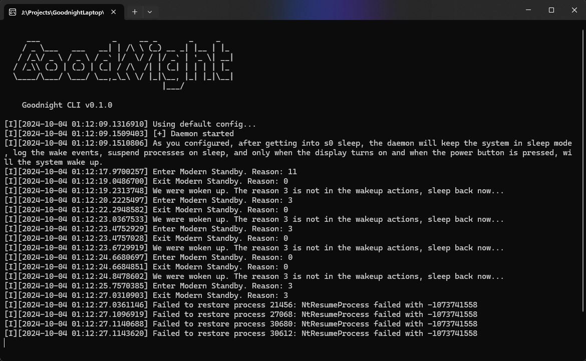

<h1>Goodnight · 晚安好梦</h1>
<h3>Fixes S0 StandBy</h3>

### What would the project do?
**In a nutshell** - Improve your laptop's standby experience & Eliminate concerns about battery drain while in your bag.

**In detail**
 - Suspend nearly all processes during sleep.
 - Disable network connections, mouse input, and keyboard input while sleeping. [WIP]
 - Quickly return to sleep if accidentally awakened.
 - Log kernel power events.
 - Turn off "Away Mode" to prevent interference with normal S0 sleep.

Goodnight is a CLI application, a GUI application, and a C++ library that provides a clear interface over Windows power events and management.

Fuck Microsoft. Fuck AMD & Intel.
